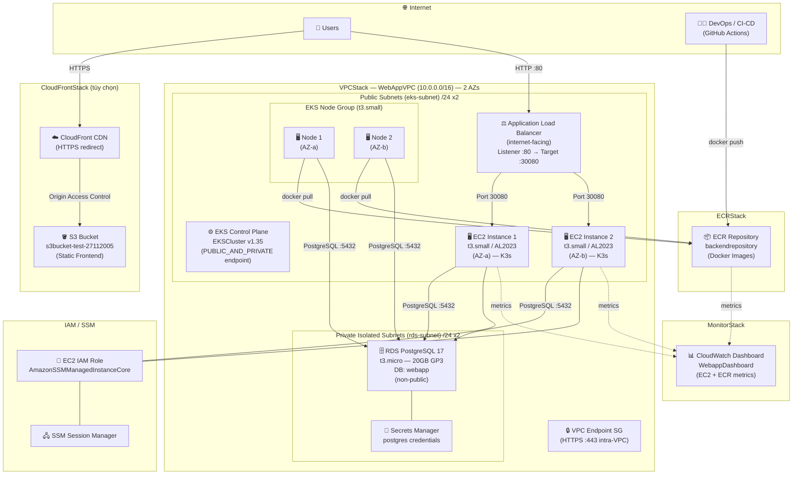
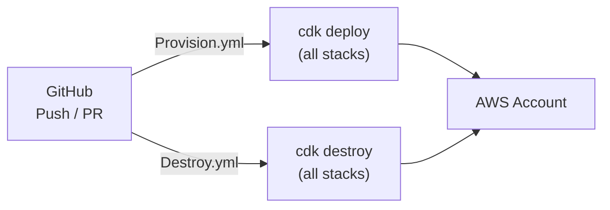

# Kiến Trúc Hạ Tầng AWS

> Được xây dựng bằng AWS CDK (TypeScript)

## Sơ Đồ Tổng Quan

---

## Chi Tiết Từng Stack

### VPCStack
| Thuộc tính | Giá trị |
|---|---|
| CIDR | `10.0.0.0/16` |
| AZs | 2 |
| Public subnets | `eks-subnet` — `/24` × 2 (MapPublicIpOnLaunch) |
| Private subnets | `rds-subnet` — `/24` × 2 (ISOLATED) |
| NAT Gateways | 0 (tiết kiệm chi phí) |
| DNS | Hostnames + Support bật |
| Tags | `kubernetes.io/role/elb: "1"` trên public subnets |

---

### EKSStack
| Thuộc tính | Giá trị |
|---|---|
| Kubernetes version | v1.35 |
| Cluster name | `EKSCluster` |
| Endpoint access | PUBLIC_AND_PRIVATE |
| Node instance | t3.small |
| Node group size | min 1 / desired 2 / max 3 |
| Subnet | eks-subnet (public) |
| Auth mode | API |
| Admin access | IAM ARN từ `Arn.txt` |

---

### EC2Stack
| Thuộc tính | Giá trị |
|---|---|
| Instances | 2 × t3.small (Amazon Linux 2023) |
| Subnet | Public (mỗi instance 1 AZ riêng) |
| Security Group ports | SSH :22, K3s API :6443, NodePort :30080 |
| Key pair | `ec2-key` (public key từ file) |
| IAM | SSM Managed Instance Core |

---

### ALBStack
| Thuộc tính | Giá trị |
|---|---|
| Type | Application Load Balancer (internet-facing) |
| Listener | HTTP :80 |
| Target | AutoScalingGroup port :30080 |
| Algorithm | Least Outstanding Requests |
| Health check | `GET /health` — 200 OK |
| Subnet | Public |

---

### RDSStack
| Thuộc tính | Giá trị |
|---|---|
| Engine | PostgreSQL 17 |
| Instance | t3.micro |
| Storage | 20 GB GP3 |
| DB name | `webapp` |
| Subnet | rds-subnet (isolated) |
| Multi-AZ | Không |
| Public access | Không |
| Credentials | Secrets Manager (`postgres`) |
| Inbound | VPC CIDR `10.0.0.0/16` → :5432 |

---

### ECRStack
| Thuộc tính | Giá trị |
|---|---|
| Repository name | `backendrepository` |
| Removal policy | DESTROY (xóa khi destroy stack) |

---

### CloudFrontStack *(hiện đang comment trong bin)*
| Thuộc tính | Giá trị |
|---|---|
| S3 Bucket | `s3bucket-test-27112005` (private, S3-managed encryption) |
| Origin | S3 + Origin Access Control |
| Protocol | Redirect HTTP → HTTPS |
| SPA fallback | 403/404 → `/index.html` |

---

### MonitorStack
| Thuộc tính | Giá trị |
|---|---|
| Dashboard | `WebappDashboard` (CloudWatch) |
| Widgets | EC2 metrics (instanceId) + ECR metrics (repositoryName) |

---

## Luồng CI/CD (GitHub Actions)

---

## Ghi Chú

- **CloudFrontStack** và **Route53** đã được code nhưng hiện bị comment trong `bin/infrastructure.ts` — chưa deploy.
- **ALBStack** không có trong `bin/infrastructure.ts` hiện tại — code sẵn nhưng chưa dùng.
- **MonitorStack** không có trong `bin/infrastructure.ts` hiện tại — code sẵn nhưng chưa dùng.
- EKS nodes nằm ở **public subnet** (không có NAT Gateway để tiết kiệm chi phí).
- RDS nằm ở **isolated subnet** — chỉ nhận kết nối từ trong VPC qua security group.
